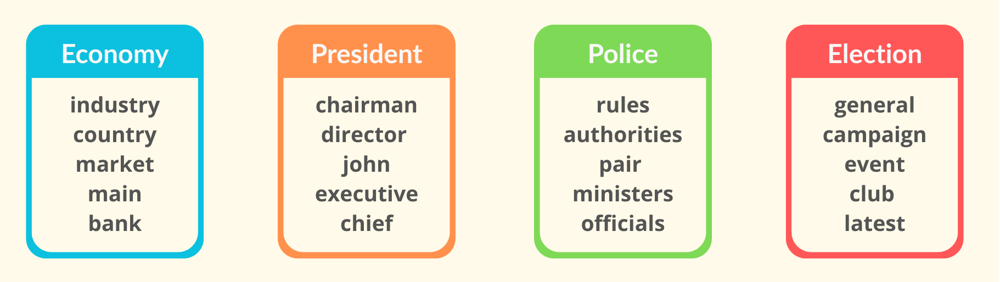
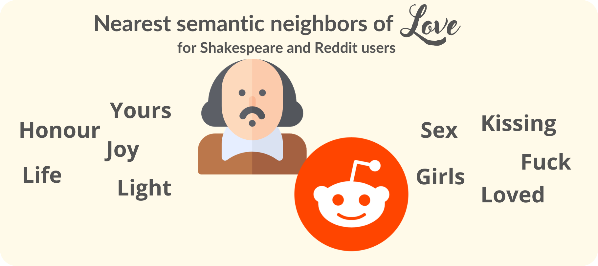

# Word2Vec in pure NumPy

**Word2Vec in pure NumPy** is a from-scratch implementation of the Skip-Gram with Negative Sampling (SGNS) algorithm that learns dense vector representations of words directly from raw text. The goal is to train word embeddings where semantically similar words are located close to each other in vector space.

The project demonstrates end-to-end understanding of word embedding training — from text preprocessing and skip-gram pair generation to manual loss computation, gradient updates, and semantic inference using cosine similarity.

# Project Overview

## 1. BBC Articles — Semantic Similarity

The model was trained on a corpus of BBC news articles to verify whether it learns meaningful semantic relationships between words in real-world text.

**Example results:**

- economy → industry, country, market, bank  
- president → chairman, director, executive, chief  
- police → authorities, ministers, officials  
- election → general, campaign, latest  

These results show that the model captures topical and functional similarity rather than simple word co-occurrence.



 `data/bbc`

---

## 2. Vector Mathematics — Word Analogies

To validate the geometric properties of the embedding space, the model was trained on a large Wikipedia corpus and tested on classic word analogies.

**Observed relationship:**

$$
\textbf{king} - \textbf{man} + \textbf{woman} \approx \textbf{queen}
$$

This confirms that the learned embeddings encode semantic directions and linear relationships in vector space — a key property of correctly trained Word2Vec models.


`data/wikitext`

---

## 3. Shakespeare vs Reddit — Dataset Influence on Word Meaning

To show how embeddings depend on the training data, the model was trained on two very different corpora: Shakespeare’s works and Reddit conversations.

**Query word:** `love`

- **Shakespeare corpus:**  
  honour, hate, life, yours, joy  

- **Reddit conversations:**  
  sex, fucking, fuck, loved, girls, kissing  

The contrast demonstrates that Word2Vec learns meaning from context distribution — poetic and emotional in Shakespeare, more casual and physical in Reddit.



``data/shakespeare`` & ``data/reddit``

# Mathematical Background

This project implements the full training loop of **Word2Vec Skip-Gram with Negative Sampling (SGNS)** entirely in pure NumPy. All key components — forward pass, loss, gradients, and SGD updates — are derived and coded manually without autograd or deep learning frameworks.

---

## Core Idea

The goal of Word2Vec is to learn vector representations of words such that words appearing in similar contexts are close in vector space.

Each word has two vectors:

- input embedding (center word)  
- output embedding (context word)  

For a real pair of words, we want their vectors to have **high dot-product similarity**. For random pairs, we want the similarity to be low.

---

## Skip-Gram with Negative Sampling

For each observed pair $(target, context)$ the model:

1. increases similarity between the real pair  
2. samples $K$ random words (negative samples)  
3. decreases similarity for those random pairs  

The similarity is measured by the dot product passed through sigmoid:

$$
\sigma(x) = \frac{1}{1 + e^{-x}}
$$

This avoids the expensive full softmax and makes training efficient.

---

## Training Step

For every skip-gram pair the implementation:

- computes dot products using NumPy  
- evaluates the negative sampling loss  
- computes gradients analytically  
- updates embeddings with SGD  

All operations are done directly on vectors — no automatic differentiation is used.

---

## Parameter Updates

Embeddings are updated using standard stochastic gradient descent:

$$
\theta \leftarrow \theta - \eta \nabla_\theta \mathcal{L}
$$

where $\eta$ is the learning rate.

Training is fully reproducible via a fixed random seed.


# Project Structure

**Directory tree**

```
├── data/  
├── experiments/  
│  └── saved_experiments/  
├── images/  
├── word2vec/  
│  ├── dataset.py  
│  ├── model.py  
│  ├── train.py  
│  ├── query.py  
│  └── utils.py  
├── requirements.txt  
├── overview.py
└── README.md
```

**Module summary**

- **dataset.py** — text preprocessing, vocabulary building, skip-gram pairs

- **model.py** — Skip-Gram with Negative Sampling implementation

- **train.py** — end-to-end training and artifact saving

- **query.py** — semantic queries on trained embeddings

- **utils.py** — unigram distribution, negative sampling, similarity tools

---

# Installation & How to Run

## Requirements

- Python 3.9+

- NumPy

- tqdm

Install dependencies:

```
pip install -r requirements.txt
```

---

## Recommended overview (for Recruiters)

The easiest way to explore the project is to run the prepared overview script:

```
python overview.py
```

This will automatically:

- load pre-trained models

- reproduce the main experiments

- display semantic similarity results

---

## Training on custom data

To train Word2Vec from scratch on any dataset:

```
python -m word2vec.train
```

The script will preprocess data, train the SGNS model, and save embeddings to `experiments/`.

---

## Query

To manually inspect embeddings and test your own words:

```
python -m word2vec.query
```

This allows interactive nearest-neighbor search and analogy testing on trained models


# Possible Alternatives & Optimizations

## 1. CBOW - Continuous Bag of Words

An important alternative to Skip-Gram is **CBOW**, which predicts the center word from its surrounding context words.

**Difference in objective:**

- **Skip-Gram:** predict context from center word

- **CBOW:** predict center word from context

In CBOW, context embeddings are typically averaged:

$$
\mathbf{h} = \frac{1}{C}\sum_{i=1}^{C}\mathbf{v}_{context_i}
$$

The model then maximizes the probability of the target word given this aggregated context vector.

**Practical trade-offs:**

- CBOW is usually **faster to train**

- Skip-Gram typically handles **rare words better**

- Both can be combined with negative sampling or hierarchical softmax

This project focuses on Skip-Gram with Negative Sampling because it more clearly exposes the pairwise training dynamics and gradient flow.

---

## 2. Hierarchical Softmax vs Negative Sampling

Another key design choice in Word2Vec is how the model approximates the softmax over the vocabulary.

**Negative Sampling (used in this project)** trains the model to distinguish real word-context pairs from randomly sampled noise words. Instead of updating the whole vocabulary, only a small number of negative samples are processed per step, which makes training very efficient.

**Hierarchical Softmax** replaces the flat softmax with a binary tree (typically a Huffman tree). Each word is represented as a path from the root to a leaf, and predicting a word becomes a sequence of binary decisions along that path.

**Practical trade-offs:**

- Negative Sampling — faster in practice, simple to implement, works well for large datasets

- Hierarchical Softmax — computes a true probability distribution, better when vocabulary is small or when many rare words are important

- Negative Sampling usually gives better embeddings for semantic similarity tasks

This project uses **Negative Sampling** for its efficiency and because it is the most commonly used variant in modern Word2Vec implementations.
